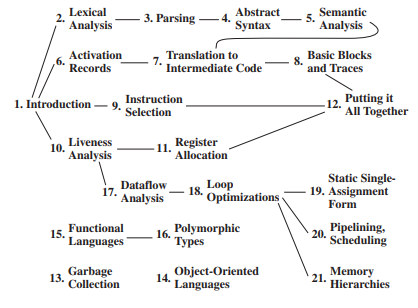

# Free-Pascal-Compiler

## 1 - Introdução.

Voce já parou pra pensar como um compilador funciona? como ele reconhece que um "if" é uma palavra reservada, onde voce nao pode ter uma variavel chamada "if" porem, pode ter uma variavel chamada if8...

## 2 - Tecnologias e Instalação.

 - Esse trabalho foi feito utilizando [JavaCC](https://javacc-github-io.translate.goog/javacc/?_x_tr_sl=en&_x_tr_tl=pt&_x_tr_hl=pt&_x_tr_pto=tc), o JavaCC é um gerador de analisador sintático aberto para a linguagem Java, voce pode facilmente instala-lo em um sistema operacional Ubuntu. Inicialmente voce precisará do Java instalado, é possivel instala-lo com o comando:
    ```bash
    $ sudo apt install default-jdk
    ```
 - Logo após voce conseguirá instalar o JavaCC com o comando:
    ```bash
    $ sudo apt install javacc   
    ```

### 2.1 - 🧪 Como testar o compilador

Para testar o compilador, siga os passos abaixo:

1. Crie um ou mais arquivos de teste utilizando a linguagem **Free Pascal**.
2. Nomeie os arquivos no seguinte formato:
   - `test.pas`, `test1.pas`, `test2.pas`, ..., `testN.pas`
3. Coloque esses arquivos no diretório [`tests`](tests).
   - Por padrão o projeto já contém alguns arquivos de teste.

> ✅ O Makefile já está configurado para identificar automaticamente todos os arquivos nesse formato e executá-los.

Para iniciar os testes, basta rodar o seguinte comando no terminal:

    ```bash
    $ make
    ```
## 3 - Descrição.

- Para entendermos como funciona um compilador temos que entender as várias etapas que se passam até que o seu codigo de alto nivel seja convertido em um codigo de baixo nivel. Para que isso aconteça temos 21 etapas principais, dentre as quais temos 12 etapas essencias para seu funcionamento, podemos ver na imagem abaixo quais são essas etapas e em destaque as etapas principais·

<p align="center">
  
</p>

<p align="center"><em>Figura: Fluxo de etapas no compilador, APPEL, Andrew W. <i>Modern Compiler Implementation in Java</i>. Cambridge University Press, 2002.</em></p>

Esse trabalho se refere a implementação de um compilador para a linguagem Free Pascal, nem todas as funcionalidades estarão presentes, porém é esperado que o mesmo identifique as principais funções da linguagem. Portanto vamos analisar cada uma das etapas principais isoladamente.

### 3.1 - Análise Léxica

- Essa etapa consiste na identificação dos tokens que são recebidos pelo compilador, em gramática seria o equivalente a uma análise sintática, ou seja, basicamente vamos apenas diferenciar palavras que existem ou não existem, por exemplo, sabemos que a palavra "computador" existe, pois esta presente no nosso dicionário, porem a palavra "jascuteam" não existe pois não esta presente no nosso dicionario, dessa mesma forma temos as palavras que são reconhecidas pela linguagem de programação e as que não são identificadas são consideradas Identificadores, que basicamente se refere as nossas variáveis. 

Para prosseguirmos temos que entender o que são os tokens.

> Um **token léxico** é uma sequência de caracteres que pode ser tratada como uma unidade na gramática de uma linguagem de programação. Uma linguagem de programação classifica tokens léxicos em um conjunto finito de **tipos de tokens**. Por exemplo, alguns dos tipos de token de uma linguagem de programação típica são:
>
> | Tipo   | Exemplos                         |
> |--------|----------------------------------|
> | `ID`     | `foo`, `n14`, `last`             |
> | `NUM`    | `73`, `0`, `00`, `515`, `082`    |
> | `REAL`   | `66.1`, `.5`, `10.`, `1e67`, `5.5e-10` |
> | `IF`     | `if`                             |
> | `COMMA`  | `,`                              |
> | `NOTEQ`  | `!=`                             |
> | `LPAREN` | `(`                              |
> | `RPAREN` | `)`                              |
>
> — *Adaptado de* **APPEL, Andrew W.** *Modern Compiler Implementation in Java*. Cambridge University Press, 2002.

- Como fazemos então para identificar tokens validos? Para isso utilizamos expressões regulares, onde conseguimos identificar cadeias e/ou padrões de caracteres de interesse. Não entraremos em detalhes sobre o funcionamento das expressões regulares visto que esse não é o objetivo do trabalho, caso se interesse pelo assunto clique [aqui](https://pt.wikipedia.org/wiki/Expressão_regular) para saber mais. Portanto, como exemplo, podemos realizar as seguintes classificações da nossa linguagem:

| Token   | Expressão Regular                         |
|--------|----------------------------------|
| `IF`     | `if`             |
| `DIGIT`    | `["0"-"9"]`    |
| `SIGN`    | `["+"] \| ["-"]`    |
| `NUMBER_REAL`    | `( <SIGN> )? ( <DIGIT> )+ "." ( <DIGIT> )*`    |

- Dessa forma podemos então identificar que o Token IF é composto pelas letras "i" e "f" em sequencia, caso ocorra "fi", "i f" ou qualquer outra formatação não será aceito como um token IF válido, o mesmo para o token DIGIT, que será composto por qualquer um dos carateres de 0 a 9, com a identificação dos tokens podemos construir todas as regras para que seja possível reconhecer todo o dicionário da nossa linguagem.

### 3.2 - Parsing


## 4 - Distribuição dos diretórios.